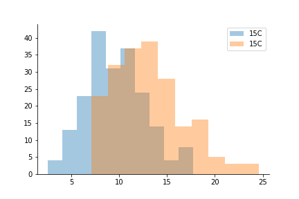

# TOC
# Overview & Motivation:
**Today we are trying to do two things:**
 - Visualise raw data
 - Explore the relationship between data
 If you're like me, you might think:
 *Why do we visualise raw data? Raw data is lame! where's that cool association? let me see the stats!*
 We visualise our raw data to:
  - Catch errors that have escaped initial quality control. ( While many pipette-people worked very hard to bring us this data, data generation and collection is as flawed as any aspect of science.)
  - Spot patterns that would be hidden by summary-statistics.
  - Make sure that all assumptions of our planned tests are met. For example, many statistical tests require that our data is normally-distributed.

# Dataset 1
Dataset 1 is a quantitative trait - body size of Population of Bananaspiders, [*Argiope appensa*](https://en.wikipedia.org/wiki/Argiope_appensa)
This dataset has two issues - one of them a data-entry error, the other one a biological feature of the data.
- Can you find them?
- Can you remove or rectify the data-entry error?
- plot the data as a boxplot, as well as a scatterplot or histogram.
- what can you see in the histogram/scatterplot that you cannot see in the boxplot?
  - optional: what is the biological significance of this?

tips:

# Dataset 2
Dataset 2 contains Growth-data from an [*Arabidopsis thaliana*]() experiment in the Greenhouse - detailing the height at first flowering. The samples were grown in two different greenhouses that were supposed to be kept at the exact same conditions.
Unfortunately something has gone wrong with the environmental control of the second greenhouse, resulting in a average temperature of 22C instead of 15C, resulting in plants that are, on average, 3 centimetres taller than the ones from the colder greenhouse.  
  
Before we redo the experiment, we would like to know if this difference is just a shift in the mean, and if the distributions are roughly the same.
For this we are going to use min-max feature scaling:
$z = frac{x - MIN(x)}{MAX(x)-MIN(x)}$

Visualise the galton height data.
 - load the data
 - plot overall distribution/histogram (hist, kde?)
 - plot box & whisker by gender
 - plot scatter with individual, mean parent height
#Task2

#Task3

#Task4

#Task5

Visualise phenotypes and calculate heritability
Time: 13:15-16:00, 2h45m
Tools: R, plink2

Learning outcomes:
The students will familiarise themselves with a few different ways of visualising phenotypes, mainly scatter, box & whisker plots and histograms.
The students will get a decent understanding of how a polygenic architecture will influence the phenotype distribution.
The students will get a vague idea of why the normalisation of some data is necessary, and how to go about it.
The students will get a deeper understanding of what heritability is.
The students will learn how to build a kinship matrix from pedigree data, as well as estimate one from genomic data using plink2
The students will learn how to estimate heritability from kinship+phenotype data using REML methods built into plink2

Tasks:
Phenotypes:
Visualise different phenotypes. What kind of genetic architecture?
Maybe have them run some basic simulations first for n biallelic genes with 1/n and  -1/n effect size and  ( I have them in python, need to translate them to R), and get a feeling for phenotype distributions in form of histograms.
Look at two different “real-world” phenotypes and guess what the genetic architecture could be ( e.g. Galton height data & something that’s vaguely monogenic.)
Normalisation of phenotypic data. Why and how.
Heritability:
Vague overview -> galton height data for basic understanding -> scatter with some colorations for f/m
Kinship matrix -> how is it made?
From family data -> explanation, but then readymade from galton data
Estimated from genomic data -> plink2, using chicken data, compare with pedigree
Using kinship matrices with plink2/REML to estimate heritability

