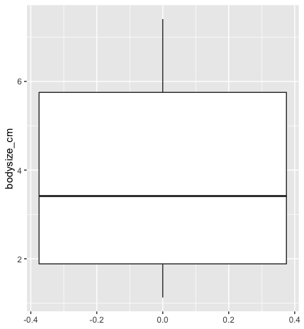

# TOC
<!-- TOC depthFrom:1 depthTo:6 withLinks:1 updateOnSave:0 orderedList:0 -->

- [TOC](#toc)
- [Overview & Motivation:](#overview-motivation)
- [Dataset1](#dataset1)
- [Dataset2](#dataset2)
- [Dataset3](#dataset3)

<!-- /TOC -->

# Overview & Motivation:
**Today we are trying to do two things:**
 - Visualise raw data
 - Explore the relationship between data.  

 We visualise our raw data to:
  - Catch errors that have escaped initial quality control.
  - Spot patterns that would be hidden by summary-statistics.
  - Make sure that all assumptions of our planned tests are met. e.g. many statistical tests require that our data is normally-distributed.


# Dataset1
Dataset 1 is a quantitative trait - body size of Population of Bananaspiders, [*Argiope appensa*](https://en.wikipedia.org/wiki/Argiope_appensa).
This dataset has two issues - one of them a data-entry error, the other one a biological feature of the data.
- Can you find them?
- Can you remove or rectify the data-entry error?
- plot the data as a boxplot, as well as a scatterplot or histogram.
- what can you see in the histogram/scatterplot that you cannot see in the boxplot?
- what is the biological significance of this?

**Notes:**  
I'm using the  [``ggplot2``](https://ggplot2.tidyverse.org/) library for plotting, since it simplifies the process a bit. The Syntax, however, is a little bit different.
You are free to use whatever way of visualisation you are most comfortable with.
In ggplot2 lpotting consists of different parts that declare which data is to be used, and another part that declares what "geom" is used to map this data onto our canvas. For example, if i wanted to plot the column ``A`` in the Dataframe ``Dataframe1`` as a boxplot, my code would look like this:

```python
ggplot(data=Dataframe1)+ #the part that declares what data to plot
geom_boxplot(mapping=aes(y=A, x=1)) # the part that declares how the data should map to  the canvas.

```

<details><summary>tips</summary>
<p>

- you can use the ```subset``` function to subset a dataframe based on conditions, e.g.


```Python
Dataframe_2 # A dataframe with two columns, A and B.
# we only want the rows where the value of B is below 300:
filtered_df2 <- subset(Dataframe_2, B<300)
```

- the geoms for boxplot, scatterplot and histogram are called ``geom_boxplot``, ``geom_point``, and ``geom_histogram``

</p>
</details>


<br>
<br>

<details><summary>walkthrough</summary>
<p>

```
# load libraries
library("data.table")
library("ggplot2")

#read in the data:
a_data <- read.csv("path/to/argiope_appensa_ss_simulata.csv", sep=",") #change path to yours!

# plot as boxplot, colour outliers in red
ggplot(data=a_data)+geom_boxplot(mapping = aes(y=bodysize_cm),outlier.colour = "red")
```
  
As you can see in this plot, most data is bunched up at the bottom of the graph, with one outlier at the top.
Given that the Y-axis is the bodysize of a small spider in centimetres, it is unlikely that a bodysize of over 500 cm represents a real datapoint. maybe someone forgot to place the decimal point during dataentry?
```
#remove the outlier:
a_data_no_outliers <- subset(a_data, bodysize_cm<100) # remove all oversized spiders.
# redo the plot
ggplot(data=a_data_no_outliers)+geom_boxplot(mapping = aes(y=bodysize_cm),outlier.colour = "red")
```
  
This looks more reasonable.

```
# plot individual datapoints next to the histogram:
ggplot(data=a_data_no_outliers)+
  geom_boxplot(mapping = aes(y=bodysize_cm),outlier.colour = "red")+
  geom_point(mapping = aes(y=bodysize_cm, x=1), alpha=0.2) #  using geom_point instead of geom_boxplot

```


here you can see that the boxplot hid something: the data clusters into two groups: one of big spiders and one of small spiders. Looking at the full dataframe, one can guess that this is due to sexual dimorphism. In spiders, the female is often much larger than the male. lets plot them as separate histograms, males shaded purple, females in orange.
```
ggplot(data=a_data_no_outliers)+
  geom_histogram(data=subset(a_data_no_outliers, sex=="male"),mapping = aes(x=bodysize_cm), alpha=0.5, fill="purple")+
  geom_histogram(data=subset(a_data_no_outliers, sex=="female"),mapping = aes(x=bodysize_cm), alpha=0.5, fill="orange")
```


</p>
</details>


<br>
<br>


# Dataset2

Dataset 2 contains Growth-data from an [*Arabidopsis thaliana*]() experiment in the Greenhouse - detailing the height at first flowering. The samples were grown in two different greenhouses that were supposed to be kept at the exact same conditions.
Unfortunately something has gone wrong with the environmental control of the second greenhouse, resulting in a average temperature of 22C instead of 15C, resulting in plants that are, on average, 3 centimetres taller than the ones from the colder greenhouse.  
  
Before we redo the experiment, we would like to know if this difference is just a shift in the mean, and if the distributions are roughly the same.
For this we are going to use min-max feature scaling:  

<center>  

  

</center>  

which transforms a dataset so it is bounded between 0 and 1.  

used on a R Dataframe column, it could look like this:
```R
z <- (dataframe$column-min(dataframe$column))/(max(dataframe$column)-min(dataframe$column))
```

- Normalise the data using min-max feature scaling and compare the two greenhouses visually by plotting them as histograms.

<details><summary>walkthrough</summary>
<p>

```
ata <- read.csv("data/A_thaliana_ss_simulata.tsv", sep = "\t") # tab separated

# split the data
ata15= subset(ata, temperature == "15")
ata22= subset(ata, temperature == "22")

z15 <- (ata15$height-min(ata15$height))/(max(ata15$height)-min(ata15$height))
z22 <- (ata22$height-min(ata22$height))/(max(ata22$height)-min(ata22$height))

# add normalised height data as column to dataframes.
ata15$height_norm <- z15
ata22$height_norm <- z22

ggplot(data=ata)+
  geom_histogram(data = ata22,mapping = aes(x=height_norm), alpha=0.5, fill="orange") +
  geom_histogram(data = ata15,mapping = aes(x=height_norm), alpha=0.5,fill ='blue')


```

</p>
</details>


<br>
<br>


when looking at the Distributions, we can see that they are almost identical, although not exactly normal: both display a small but notable positive [skew](https://en.wikipedia.org/wiki/Skewness)(a longer "tail on the right). While small deviations are usually within the tolerance of most tests, stronger positive skew, could, for example, be remedied by a squareroot transform of the data.

- take the square-root of the data and plot the distribution.


<details><summary>walkthrough</summary>
<p>

```
# concatenate the two dataframes for convenience:
ata_new <- rbind(ata15,ata22)

# take the squareroot of the normalised height-data:
sqrt_height_norm <- sqrt(ata_new$height_norm)

# create a new column with the squareroot transformed data in the dataframe:
ata_new$sqrt_norm_height <- sqrt_height_norm

# plot the  transformed data (blue) alongside the original (in red):
ggplot(data=ata_new)+ geom_histogram(mapping = aes(x=sqrt_norm_height), alpha=0.5, fill='blue')+ geom_histogram(mapping = aes(x=height_norm), alpha=0.5, fill="red")

```

</p>
</details>


<br>
<br>


- Beside a deviation from normal assumptions, can you think of some more reasons why it could still be problematic to use the data?

# Dataset3

Dataset 3 is a very famous dataset - its the 1886 Height Data collected by Galton. It contains data on the height of individuals and their parents.

- Visualise and explore the data.
 - plot all individuals using a visualisation of your choice (e.g. histogram, pointplot, boxplot)
 - plot all individuals while accounting for/visualising their sex
 - plot a scatterplot with individuals height as Y and mean parent height as X Variable.
    - If you want, add a linear model of height as a function of mean-parent-height.


    <details><summary>walkthrough</summary>
    <p>

    ```python
    # load data, remember the .tsv ending! this file is tab separated.
    ghdata <- read.csv("data/galton_height_data.tsv", sep="\t")

    # plot overall distribution of values as a histogram
    ggplot(data = ghdata) + geom_histogram(mapping=aes(x=height))
    # europeans, wondering why the numbers seem off? 1886 england didnt use centimetres

    # plotting one boxplot per gender
    ggplot(data = ghdata)+ geom_boxplot(mapping = aes(y=height, x=gender))

    # take the mean of father & mother for each individual
    # save as a column in the dataframe
    ghdata$mean_parent <- rowMeans(ghdata[c('father', 'mother')], na.rm=TRUE)


    # ggplot2 has a rather convenient plotting option in geom_smooth, so i dont even need to plug in a linear model library :)
    ggplot(data = ghdata)+
      geom_point(mapping = aes(x=mean_parent, y=height, colour=gender))+
      geom_smooth(mapping = aes(x=mean_parent, y=height),method = "lm") # height as a function of mid-parent height

    # if i want to have a closer look at the summary stats of the model, i have to do a real fit, though.

    library("lme4")
    height_fit <- lm(height~mean_parent, data=ghdata)
    summary(height_fit)
    ```

    </p>
    </details>


    <br>
    <br>

When i ran the linear model, the summary output looked like this:

```
Call:
lm(formula = height ~ mean_parent, data = ghdata)

Residuals:
    Min      1Q  Median      3Q     Max
-8.9814 -2.6604 -0.1642  2.7795 11.6762

Coefficients:
            Estimate Std. Error t value Pr(>|t|)    
(Intercept)  22.1488     4.3076   5.142 3.34e-07 ***
mean_parent   0.6693     0.0646  10.360  < 2e-16 ***
---
Signif. codes:  0 ‘***’ 0.001 ‘**’ 0.01 ‘*’ 0.05 ‘.’ 0.1 ‘ ’ 1

Residual standard error: 3.388 on 896 degrees of freedom
Multiple R-squared:  0.107,	Adjusted R-squared:  0.106
F-statistic: 107.3 on 1 and 896 DF,  p-value: < 2.2e-16
```

While the correlation is very significant, the pairwise correlation (Rsquared) is lower than one would maybe expect.
 - can you think of factors that our model didnt account for?


 # Finish


